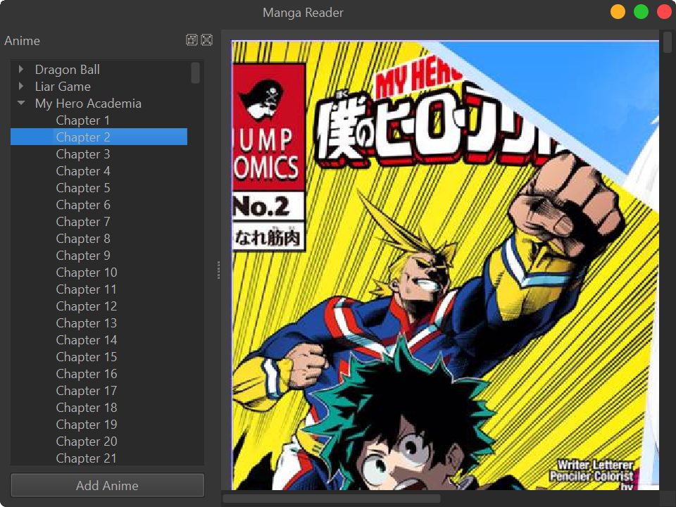

# pyApps
Some Small yet Useful Python GUI Apps

Manga Reader

 
 <figcaption>Simplest Manga Reader</figcaption>

<!-- TODO: Write a python script to automate this ReadMe and include all sub-projects from src -->
