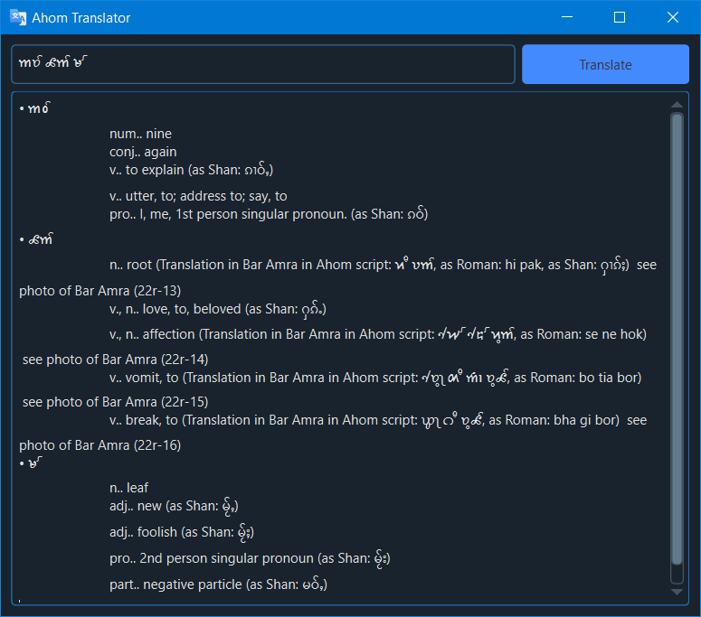

<h1 align='center'>  Ahom Translator</h1>
<p align='center'>
    <br>
    A Simple Ahom Translator with PyQT6 & BeautifulSoup4
</p>

## Synopsis

Enter a URL to scan, a depth and the app will crawl all the links it can find based on the depth  

## Installation

Install the [requirements](#requirements)
```bash
pip install PySide6
pip install BeautifulSoup
pip install qdarkstyle
pip install requests
```

## Download

Click here to [Download Ahom Translator](https://downgit.github.io/#/home?url=https://github.com/besnoi/pyapps/tree/main/src/Ahom%20Translator)

## Requirements
- PySide6
- BeautifulSoup
- qdarkstyle
- requests

## License

See [LICENSE](https://github.com/besnoi/pyApps/blob/main/LICENSE) for more information
