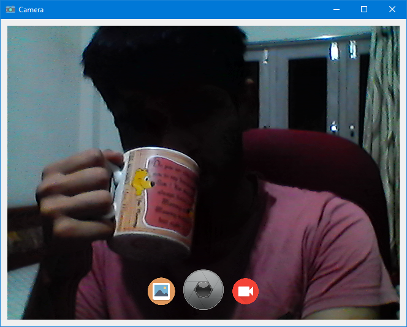

<h1 align='center'>  Camera</h1>
<p align='center'>
    <br>
    A Simple Camera app with PyQt5 (<em>forgive my webcam</em>)
</p>

## Synopsis

Just any other camera app, might add more features later like flipping, background-removal, etc

## Installation

Install the [requirements](#requirements)
```bash
pip install PyQt5
pip install pyqtdarktheme
```

## Download

Click here to [Download Camera](https://downgit.github.io/#/home?url=https://github.com/besnoi/pyapps/tree/main/src/Camera)

## Requirements
- PyQt5
- pyqtdarktheme

## License

See [LICENSE](https://github.com/besnoi/pyApps/blob/main/LICENSE) for more information
