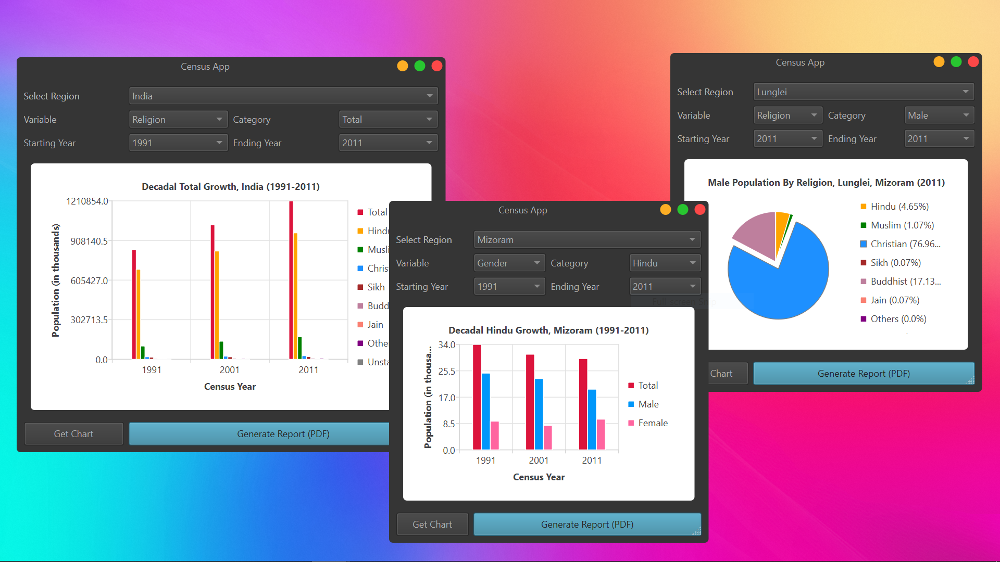

<h1 align='center'>  Census App</h1>
<p align='center'>
    <br>
    A sophisticated-Census App with PySide6
</p>

## Synopsis

Select the Region and year and the app plots the decadal population growth or population proportion with Bar Graphs and Pie Charts. Currently only Assam districts are supported

## Installation

Install the [requirements](#requirements)
```bash
pip install PySide6
```

## Download

Click here to [Download Census App](https://downgit.github.io/#/home?url=https://github.com/besnoi/pyapps/tree/main/src/Census%20App)

## Requirements
- PySide6

## License

See [LICENSE](https://github.com/besnoi/pyApps/blob/main/LICENSE) for more information
