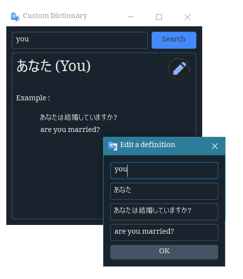

<h1 align='center'>  Custom Dictionary</h1>
<p align='center'>
    <br>
    A custom dictionary application 
</p>

## Synopsis

Unlike the [English dictionary](https://github.com/besnoi/pyapps/tree/main/src/Dictionary), this one allows the user to insert his own words definition and examples. So you can make it to English-Japanese, English-Javanese or anything depending on your utility

## Installation

Install the [requirements](#requirements)
```bash
pip install PySide6
pip install qdarkstyle
```

## Download

Click here to [Download Custom Dictionary](https://downgit.github.io/#/home?url=https://github.com/besnoi/pyapps/tree/main/src/Custom%20Dictionary)

## Requirements
- PySide6
- qdarkstyle

## License

See [LICENSE](https://github.com/besnoi/pyApps/blob/main/LICENSE) for more information
