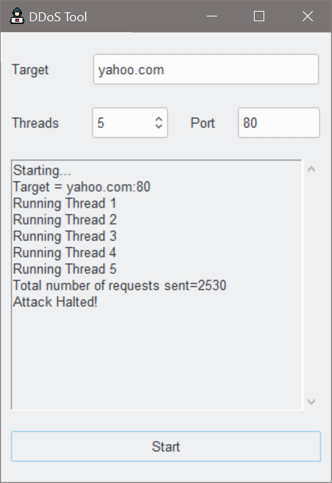

<h1 align='center'>  DDoS Tool</h1>
<p align='center'>
    <br>
    DDoS Tool
</p>

## Synopsis

A simple DDoS tool to pentest your server against such attacks

## Installation

Install the [requirements](#requirements)
```bash
pip install ttkthemes
```

## Download

Click here to [Download DDoS Tool](https://downgit.github.io/#/home?url=https://github.com/besnoi/pyapps/tree/main/src/DDoS%20Tool)

## Requirements
- ttkthemes

## License

See [LICENSE](https://github.com/besnoi/pyApps/blob/main/LICENSE) for more information
