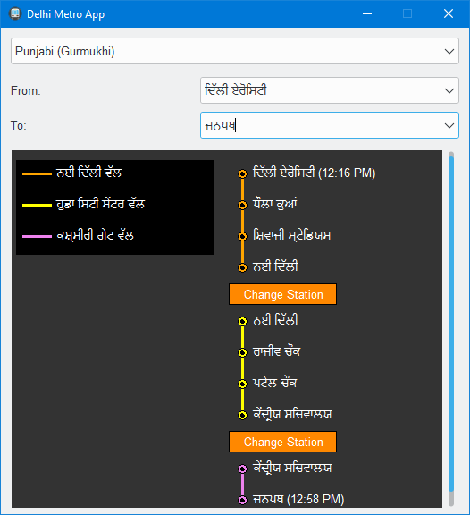

<h1 align='center'>  Delhi Metro App</h1>
<p align='center'>
    <br>
    Delhi Metro App
</p>

## Synopsis

A simple app to get the route, interchange points and travel time to help you in your Delhi metro journey.  Just select your language (default English), source and destination and that's it

## Installation

Install the [requirements](#requirements)
```bash
pip install ttkthemes
pip install requests
```

## Download

Click here to [Download Delhi Metro App](https://downgit.github.io/#/home?url=https://github.com/besnoi/pyapps/tree/main/src/Delhi%20Metro%20App)

## Requirements
- ttkthemes
- requests

## Caveats

The app currently uses an external untested API, so the top priority for any future commit would be to replace that with a homemade api;
Contributions are of-course welcome 

## License

See [LICENSE](https://github.com/besnoi/pyApps/blob/main/LICENSE) for more information
