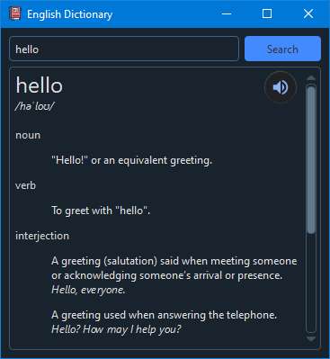

<h1 align='center'>  Dictionary</h1>
<p align='center'>
    <br>
    A Simple Dictionary application with PySide6
</p>

## Synopsis

Enter a word to search and it gives you all the definitions with examples and even it's pronounciation with audio

## Installation

Install the [requirements](#requirements)
```bash
pip install PySide6
pip install qdarkstyle
pip install requests
pip install playsound==1.2.2
```

## Download

Click here to [Download Dictionary](https://downgit.github.io/#/home?url=https://github.com/besnoi/pyapps/tree/main/src/Dictionary)

## Requirements
- PySide6
- qdarkstyle
- requests
- playaudio

## License

See [LICENSE](https://github.com/besnoi/pyApps/blob/main/LICENSE) for more information
