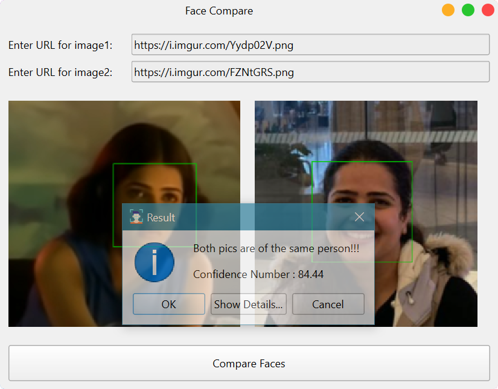

<h1 align='center'>  Face Compare</h1>
<p align='center'>
    <br>
    A simple face-detector and comparer
</p>

## Synopsis

Select the two pictures you want to compare and the AI will tell you if the pictures are of the same person or not!

## Installation

Install the [requirements](#requirements)
```bash
pip install imutils
pip install wget
pip install numpy
pip install qtmodern
pip install facepplib
pip install PySide6
```

## Download

Click here to [Download Face Compare](https://downgit.github.io/#/home?url=https://github.com/besnoi/pyapps/tree/main/src/Face%20Compare)

## Requirements

- imutils
- wget
- numpy
- qtmodern
- facepplib
- PySide6

## License

See [LICENSE](https://github.com/besnoi/pyApps/blob/main/LICENSE) for more information
