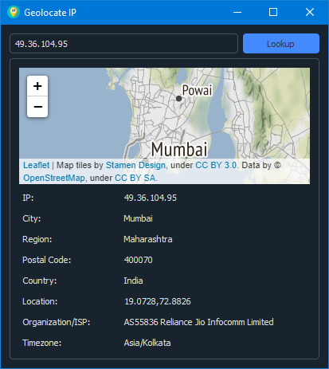

<h1 align='center'>  Geolocate IP</h1>
<p align='center'>
    <br>
    A Simple IP Lookup application with PyQT5
</p>

## Synopsis

Enter an IP to lookup, and the app will give you all details it can with map   

## Installation

Install the [requirements](#requirements)
```bash
pip install PyQt5
pip install qdarkstyle
pip install folium
```

## Download

Click here to [Download Geolocate IP](https://downgit.github.io/#/home?url=https://github.com/besnoi/pyapps/tree/main/src/Geolocate%IP)

## Requirements
- PyQt5
- qdarkstyle
- folium

## License

See [LICENSE](https://github.com/besnoi/pyApps/blob/main/LICENSE) for more information
