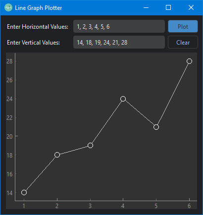

<h1 align='center'>  Github Profiler</h1>
<p align='center'>
    <br/>
    A simple Github Profiler with PySide6
</p>

## Sypnosis

A simple app to give all important user data that is publically available on Github


## Installation

Install the [requirements](#requirements)
```bash
pip install PySide6
pip install pyqtgraph
pip install qdarktheme
pip install pillow
pip install requests
```

## Download

Click here to [Download Github Profiler](https://downgit.github.io/#/home?url=https://github.com/besnoi/pyapps/tree/main/src/Github%20Profiler)

## Requirements
- PySide6
- PyQTgraph
- qdarktheme
- PIL
- requests


## License

See [LICENSE.MD](../../LICENSE.MD) for more information
