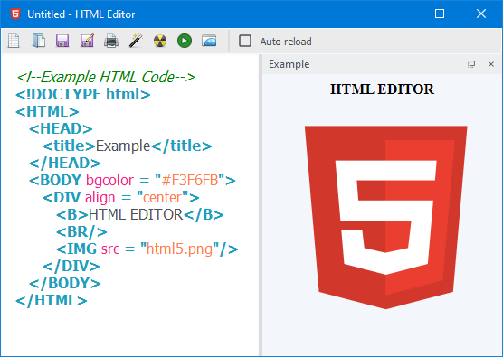

<h1 align='center'>  HTML Editor</h1>
<p align='center'>
    <br>
    A Simple HTML Editor with PyQT5
</p>

## Synopsis

A themed-HTML editor with live preview. And yes there's dark mode too!

## Installation

Install the [requirements](#requirements)
```bash
pip install bs4
pip install PyQt5
pip install qtdarktheme
```

## Download

Click here to [Download HTML Editor](https://downgit.github.io/#/home?url=https://github.com/besnoi/pyapps/tree/main/src/HTML%20Editor)

## Requirements
- Beautiful Soup
- PyQt5
- qtdarktheme

## Caveats

Because I made the app in a day the HTML Syntax Highlighter could be buggy in many peculiar situations

So a TODO is to rewrite the entire parser, which would be not too soon unless the reader does a PR :D

## License

See [LICENSE](https://github.com/besnoi/pyApps/blob/main/LICENSE) for more information
