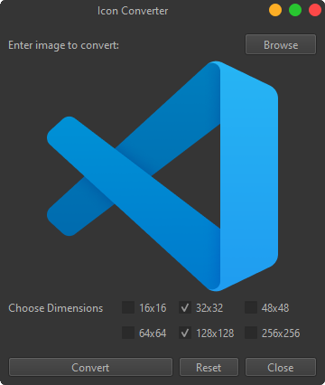

<h1 align='center'>  Icon Converter</h1>
<p align='center'>
    <br>
    A Simple Icon Converter with PySide6
</p>

## Synopsis

Add an image to convert and the app will convert it to icon, that's that

## Installation

Install the [requirements](#requirements)
```bash
pip install PySide6
```

## Download

Click here to [Download Icon Converter](https://downgit.github.io/#/home?url=https://github.com/besnoi/pyapps/tree/main/src/Icon%20Converter)

## Requirements
- PySide6

## License

See [LICENSE](https://github.com/besnoi/pyApps/blob/main/LICENSE) for more information
