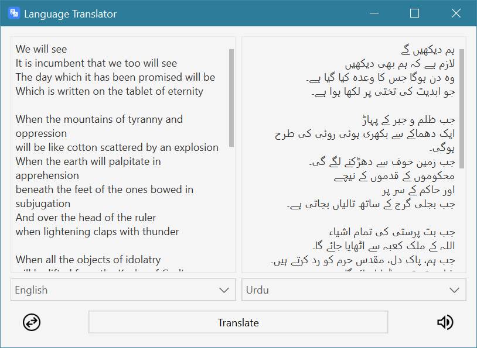

<h1 align='center'>  Language Translator</h1>
<p align='center'>
    <br>
    A simple language-translator
</p>

## Synopsis

Select the language to translate from and to, and the app will do the rest

## Installation

Install the [requirements](#requirements)
```bash
pip install PyQt5
pip install qtvscodestyle 
pip install googletrans==3.1.0a0
```

## Download

Click here to [Download Language Translator](https://downgit.github.io/#/home?url=https://github.com/besnoi/pyapps/tree/main/src/Language%20Translator)

## Requirements
- PyQt5
- qtvscodestyle
- googletrans

## License

See [LICENSE](https://github.com/besnoi/pyApps/blob/main/LICENSE) for more information
