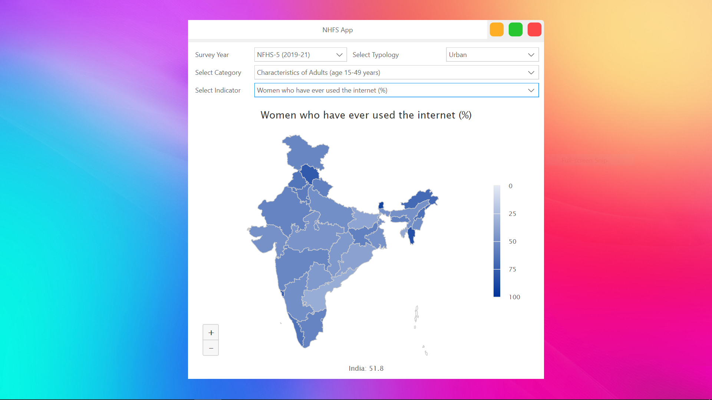

<h1 align='center'>  NFHS App</h1>
<p align='center'>
    <br>
    A sophisticated-NFHS App with PySide6
</p>

## Synopsis

Select the Key Indicator the app plots a choropleth map as per latest NFHS Survey. Requires internet to connect to the API

## Installation

Install the [requirements](#requirements)
```bash
pip install PySide6
pip install qtvscodestyle
pip install qtmodern
pip install requests
```

## Download

Click here to [Download NFHS App](https://downgit.github.io/#/home?url=https://github.com/besnoi/pyapps/tree/main/src/NFHS%20App)

## Requirements
- PySide6
- qtvscodestyle
- qtmodern
- requests

## License

See [LICENSE](https://github.com/besnoi/pyApps/blob/main/LICENSE) for more information
