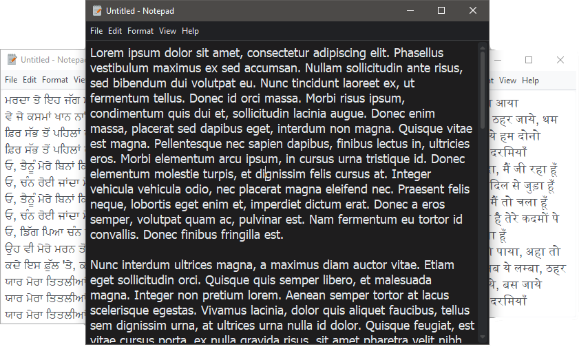

<h1 align='center'>  Notepad</h1>
<p align='center'>
    <br>
    A Simple Notepad application with PyQT5
</p>

## Synopsis

A themed-text editor set to mimic Microsoft's Notepad 

## Installation

Install the [requirements](#requirements)
```bash
pip install PyQt5
pip install qtdarktheme
```

## Download

Click here to [Download Notepad](https://downgit.github.io/#/home?url=https://github.com/besnoi/pyapps/tree/main/src/Notepad)

## Requirements
- PyQt5
- qtdarktheme

## License

See [LICENSE](https://github.com/besnoi/pyApps/blob/main/LICENSE) for more information
