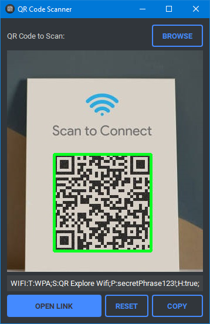

<h1 align='center'>  QR-Code Scanner</h1>
<p align='center'>
    <br>
    A primitive QR-Scanner with PyQT5 & Open-CV (<i>wifi-link demonstration</i>)
</p>

## Synopsis

Select the image that is  ̶ or that  ̶ contains the QR-code and that's it; it maybe a wifi-link, web-URL or just some meaningless data in former cases of which you can use the built-in 'Open Link' feature

## Installation

Install the [requirements](#requirements)
```bash
pip install PyQt5
pip install qt_material
pip install pyperclip
pip install cv2
```

## Download

Click here to [Download QR Code Scanner](https://downgit.github.io/#/home?url=https://github.com/besnoi/pyapps/tree/main/src/QR%20Code%20Generator)

## Requirements
- PyQt5
- qt_material
- pyperclip
- cv2

## License

See [LICENSE](https://github.com/besnoi/pyApps/blob/main/LICENSE) for more information
