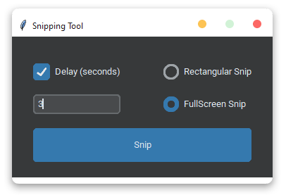

<h1 align='center'>  Snipping Tool</h1>
<p align='center'>
    
</p>

## Installation

Install the [requirements](#requirements)
```bash
pip install pygame
pip install customtkinter
```

## Download

Click here to [Download Snipping Tool](https://downgit.github.io/#/home?url=https://github.com/besnoi/pyapps/tree/master/src/Snipping%20Tool)

## Requirements
- pygame
- customtkinter

## License

See [LICENSE.MD](../../LICENSE.MD) for more information