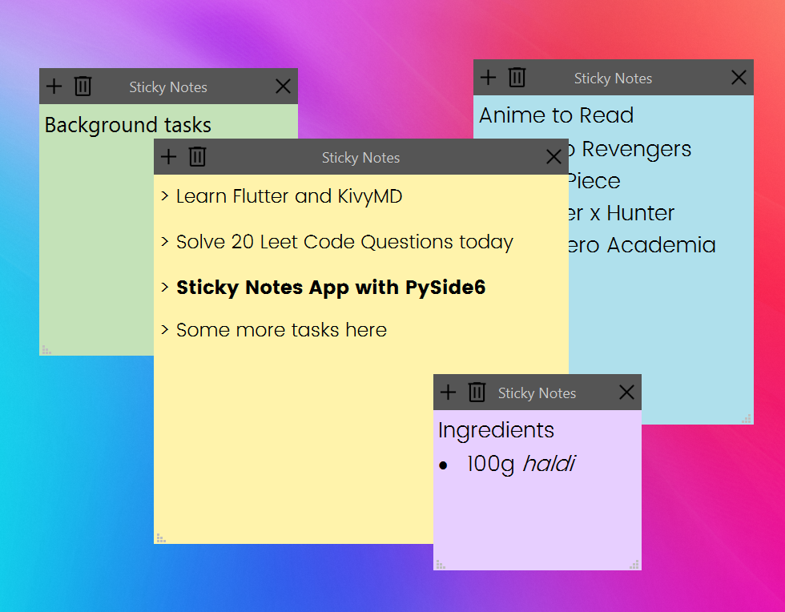

<h1 align='center'>  Sticky Notes</h1>
<p align='center'>
    <br>
    A Simple Sticky Notes App with PySide6
</p>

## Synopsis

A simple Notes app with rich text-editor, notes are saved automatically

## Installation

Install the [requirements](#requirements)
```bash
pip install PySide6
```

## Download

Click here to [Download Sticky Notes](https://downgit.github.io/#/home?url=https://github.com/besnoi/pyapps/tree/main/src/Sticky%20Notes)

## Requirements
- PySide6

## License

See [LICENSE](https://github.com/besnoi/pyApps/blob/main/LICENSE) for more information
