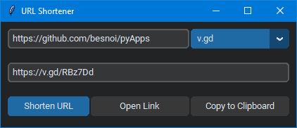

<h1 align='center'>  URL Shortener</h1>
<p align='center'>
    <br>
    A Simple URL-Shortener with Tkinter
</p>

## Synopsis

Just enter the long url to shorten, select the service/API and hit Shorten 

## Installation

Install the [requirements](#requirements)
```bash
pip install customtkinter
pip install pyperclip
pip install requests
```

## Download

Click here to [Download URL Shortener](https://downgit.github.io/#/home?url=https://github.com/besnoi/pyapps/tree/main/src/URL%20Shortener)

## Requirements
- customtkinter
- pyperclip
- requests

## License

See [LICENSE](https://github.com/besnoi/pyApps/blob/main/LICENSE) for more information
