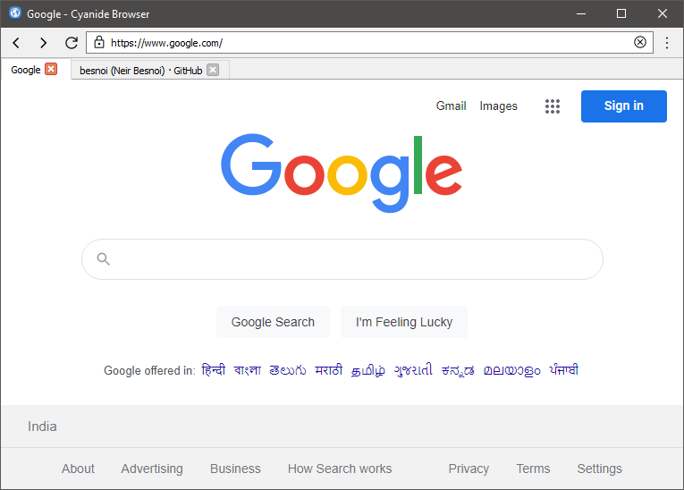

<h1 align='center'>  Web Browser</h1>
<p align='center'>
    <br>
    A simple tabbed-browser with PyQT5
</p>

## Synopsis

Enter desired URL and surf the web like any traditional browser. No external themes used

## Installation

Install the [requirements](#requirements)
```bash
pip install PyQt5
```

## Download

Click here to [Download Web Browser](https://downgit.github.io/#/home?url=https://github.com/besnoi/pyapps/tree/main/src/Web%20Browser)

## Requirements
- PyQt5

## License

See [LICENSE](https://github.com/besnoi/pyApps/blob/main/LICENSE) for more information
