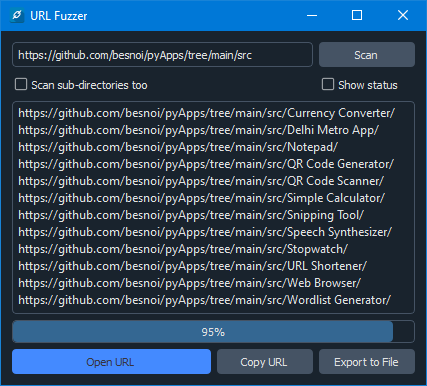

<h1 align='center'>  Web Crawler</h1>
<p align='center'>
    <br>
    A Simple Web Crawler application with PyQT5 & BeautifulSoup
</p>

## Synopsis

Enter a URL to scan, a depth and the app will crawl all the links it can find based on the depth  

## Installation

Install the [requirements](#requirements)
```bash
pip install BeautifulSoup
pip install PyQt5
pip install qdarkstyle
pip install pyperclip
pip install requests
```

## Download

Click here to [Download Web Crawler](https://downgit.github.io/#/home?url=https://github.com/besnoi/pyapps/tree/main/src/Web%20Crawler)

## Requirements
- BeautifulSoup
- PyQt5
- qdarkstyle
- pyperclip
- requests

## Caveats

This is an extremely simple web crawler which is as good as dead when it comes to crawling dynamic webpages built with Angular and other modern frameworks

Crawling dynamic webpages requires emulating browser behaviour which I assume can't be done within 50-100 lines of code

> Feel free to pull request if you can re-write the entire code to use `Selenium` 

## License

See [LICENSE](https://github.com/besnoi/pyApps/blob/main/LICENSE) for more information
