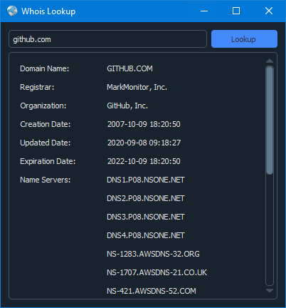

<h1 align='center'>  Whois Lookup</h1>
<p align='center'>
    <br>
    A Simple Whois GUI application with PyQT5
</p>

## Synopsis

Enter a URL to lookup, and the results show in a scrollable-frame   

## Installation

Install the [requirements](#requirements)
```bash
pip install PyQt5
pip install qdarkstyle
```

## Download

Click here to [Download Whois Lookup](https://downgit.github.io/#/home?url=https://github.com/besnoi/pyapps/tree/main/src/Whois%20Lookup)

## Requirements
- PyQt5
- qdarkstyle

## License

See [LICENSE](https://github.com/besnoi/pyApps/blob/main/LICENSE) for more information
