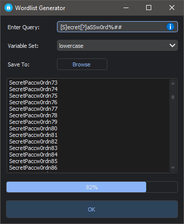

<h1 align='center'>  Wordlist Generator</h1>
<p align='center'>
    <br>
    A fully-featured wordlist generator with PyQT5
</p>

## Synopsis

Entry the query and optionally select your variable set and hit OK. 
> [Q]werty###

The above query gives `Qwerty111 , Qwerty112 , ... , Qwerty999`

## Query Format

The basic crux of any query is a combination of sets, each set representing the loop, eg-
> [xyz][@B][12]

which will result in `x@1,x@2,..,zB2` if you get the idea

As a shorthand, you can use the tokens below to represent their respective sets  
> ' # ' (numeric)
> 
> ' $ '  (uppercase) 
> 
> ' % ' (lowercase)
> 
> ' * ' (alphabetic)
> 
> ' ^ ' (alphanumeric)  

so for prespective a query `$%^*#` would give `Aaaa1,Aaaa2,..,Zz9Z9`

Lowercase letters represent their individual set, so queries `a` and `[a]` are technically equivalent.
Uppercase letters are more complicated for they represent *identifiers*; what this means is that all identifiers with same name represent the same value,
for eg, `AoA` will give `AoA,BoB,..,LoL,..,ZoZ` (if your variable set is set to uppercase)

Identifiers have their own set, which you can specify with the `Variable set` option.
You can have more-than-one number of identifiers in your query (maximum 26 number) for eg, `ZYBBO` will give `hello` as one of the result

Any other character represents their individual sets, eg `!&123@`

## Installation

Install the [requirements](#requirements)
```bash
pip install PyQt5
pip install qdarktheme
```

## Download

Click here to [Download Wordlist Generator](https://downgit.github.io/#/home?url=https://github.com/besnoi/pyapps/tree/main/src/Wordlist%20Generator)

## Requirements
- PyQt5
- qdarktheme

## License

See [LICENSE](https://github.com/besnoi/pyApps/blob/main/LICENSE) for more information
