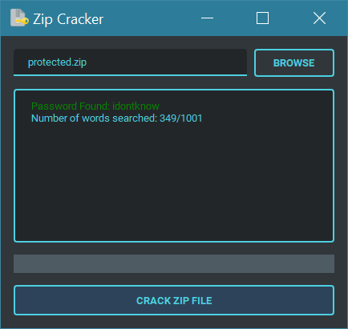

<h1 align='center'>  Zip Cracker</h1>
<p align='center'>
    <br>
    A simple Zip Cracker with zipfile & PyQT5
</p>

## Synopsis

You give it a password-protected Zipfile and the app will try to crack it based on `wordlist.txt`

## Installation

Install the [requirements](#requirements)
```bash
pip install PyQt5
pip install qt-material
```

## Download

Click here to [Download Zip Cracker](https://downgit.github.io/#/home?url=https://github.com/besnoi/pyapps/tree/main/src/Zip%20Cracker)

## Requirements
- PyQt5
- qt-material

## License

See [LICENSE](https://github.com/besnoi/pyApps/blob/main/LICENSE) for more information
